# Administración de módulos en ODOO

## Laboratorio 02

Listado de tareas:
-----------------
1. Verificamos nuestros módulos instalados y  no instalados
2. Instalamos los módulos "Proyecto", "Gestion de inventario", "Gestion de ausencias" y "Punto de venta" y Verificamos las instalaciónes.
3. Activar el modo desarrollador.
4. Creamos un módulo en ODOO.
5. Modificar el módulo creado

### Verificamos nuestros módulos instalados y  no instalados.

Vemos todos nuestros modulos instalados haciendo uso de filtros, estos pueden ya estar especificados o podemos acer uno mas personal.

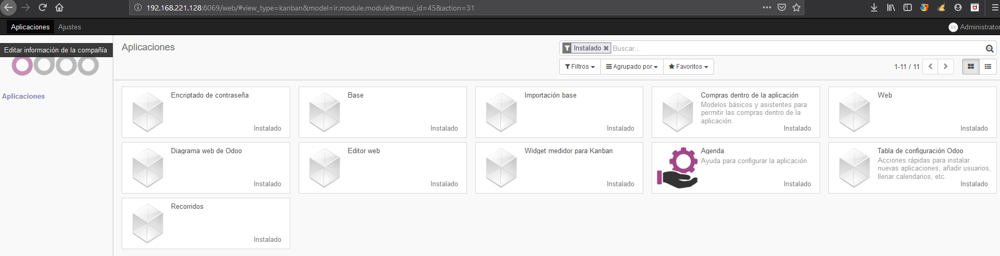

De la misma manera podemos ver los que no tengamos instalados, para instalarlos posteriormente

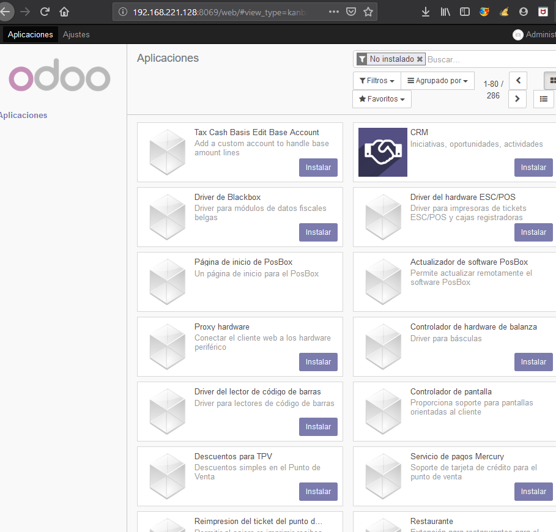

### Instalamos los módulos "Proyecto", "Gestion de inventario", "Gestion de ausencias" y "Punto de venta".

Buscamos algunos módulos para poder instalarlos y hacer uso de ellos, como por ejemplo **Proyecto** pero instalamos algunos otros tambien

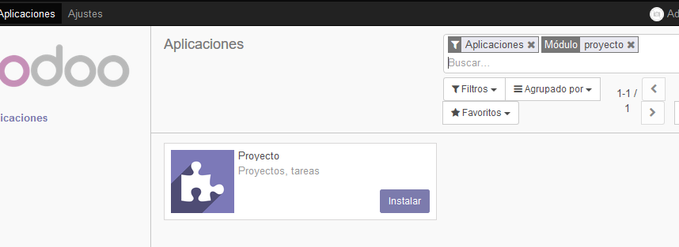

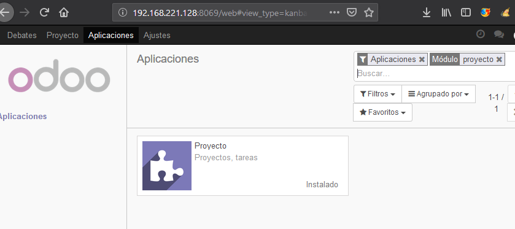

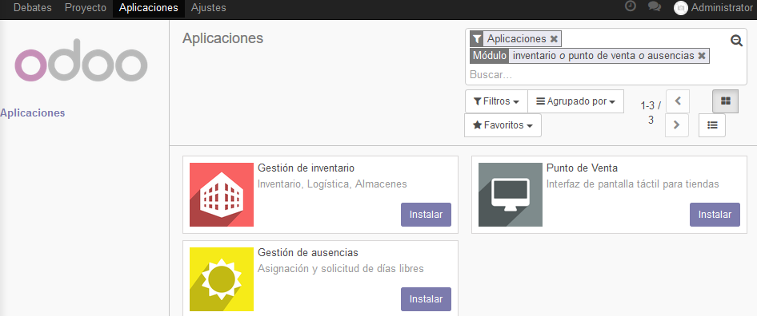

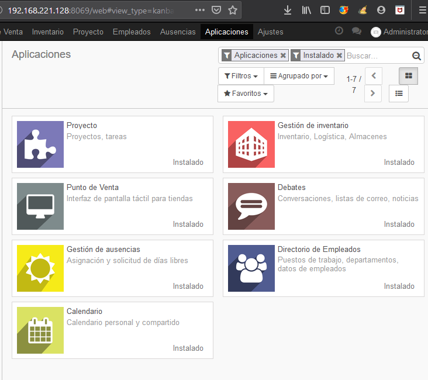

### Activamos el modo desarrollador

Hacemos clic en ajustes para poder hacer uso del modo de desarrollo y así poder crear nuevos módulos y demás.

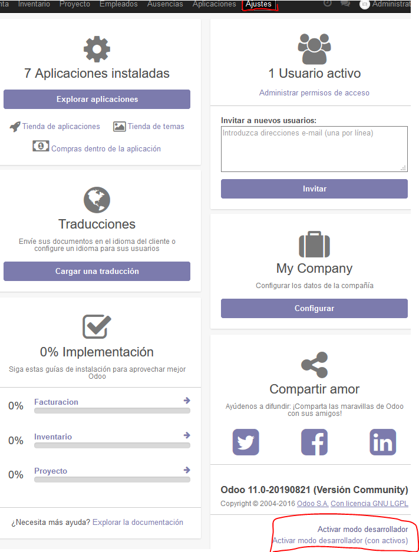

Creamos el nuevo módulo que denominaremos **_testmodulo1_** haciendo uso del siguiente comando **"c:\Program    Files    (x86)\Odoo    11.0\python\python.exe"    "c:\Program    Files    (x86)\Odoo11.0\server\odoo-bin" scaffold testmodulo1 odoo/addons** todo en una sola líena

y debemos estar ubicados en nuestra carpeta donde se instaló _ODOO_ es decir aqui dentro *_"Folder raiz Odoo"/server/odoo/addons_*

### Creamos un nuevo módulo

Despues de haber ejecutado el comando anterior ingresamos a la carpeta de destino y verificamos que efectivamente se haya creado nuestra carpeta llamada _"testmodulo1"_

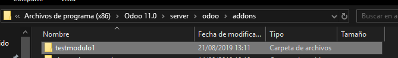

revisamos su contenido

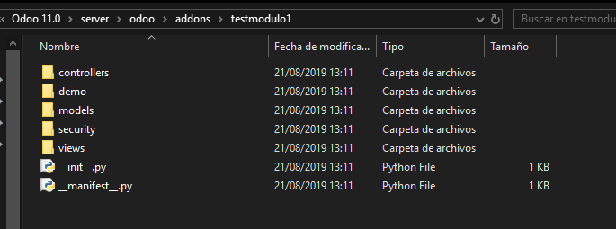

la creación del nuevo módulo fue un exito, ahora modificaremos el módulo para mayor personalización.

### Modificar el modulo creado

Veremos el contenido de nuestro archivo **__init_.py** para saber como es en un principio.

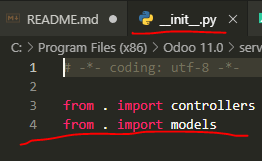

Ahora modificaremos el contenido del archivo **__manifest_.py** del cual se extrae la informacion del módulo

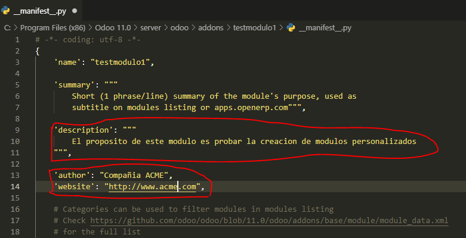

Para que nos aparezca este nuevo módulo tenemos que actualizar la lista de aplicaciones y confirmamos dicha actualización

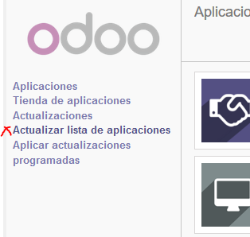

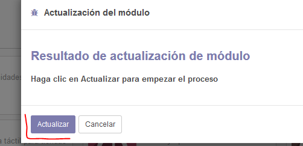

Verificamos la existencia de nuestro módulo y luego  lo instalaremos para verificar que efectvamente se puede usar en ODOO.

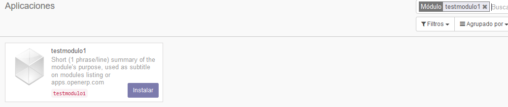

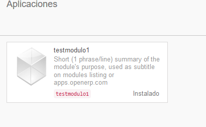

Vemos los detalles para verificar que nuestros cambios si se realizaron con exito en el archivo **__manifest_.py**

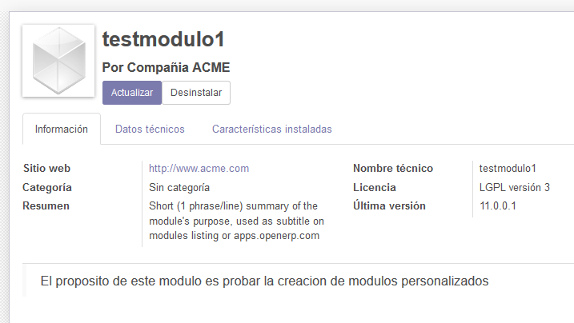

#### Descripción de funcionalidad de cada elemento.
 Nro | Nombre de Módulo | Descripción 
:----- | :----------------: | -----------: 
 1 | _init__.py | Con este archivo podemos hacer la importación desde python. 
 2 | _manifest__.py |  | Este es el archivo que se encarga de la descripción del módulo, módulos del cual depende, carga las vistas involucradas en el módulo, datos demo, datos de seguridad, etc. 
 3 | controllers | Dondes se declaran todos los controladores, con los cuales daremos como su nombre lo dice un control para prácticamente todo el módulo y la extracción e inserción de datos. 
 4 | models | donde se declaran todos los modelos de la base de datos que se representan como tablas en postgres 
 5 | Security | Donde se encuentran las reglas de seguridad de nuestros modelos 
 6 | views | Donde se declaran las vistas xml de nuesto módulo 