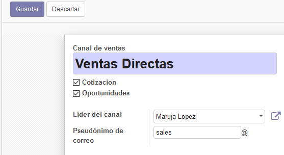

# CRM en ODOO

## Laboratorio 03

Listado de tareas:
------------------
1. Instalación y utilización del módulo CRM
2. Configuramos ODOO CRM - Planificador de ventas
3. Configuramos ODOO CRM - Clientes
4. Equipo de ventas - Equipo de ventas directas
5. Iniciativas y oportunidades
6. Iniciativas desde sitio web ODOO

### Instalación y utilización del módulo CRM

Buscamos e instalamos el módulo CRM en la ventana de aplicaciones, esperamos a que finalze el proceso y después ingresamos al link que se ha creado.

Primeras vista del módulo.

### Configuramos ODOO CRM - Planificador de ventas

En la parte superior hacemos clic en la barra de progreso situada en la parte superior de la pantalla, se nos mostrará el asistente de configuracion del módulo.

Una vez dentro, ingresamos las expectativas de la estrategia.

Ingresamos los KPIs de la estrategia.

Configuramos el flujo de trabajo para la estrategia.

Revisamos las demas ventanas peron no modificamos nada y por último se nos muestra la pantalla final.

### Configuramos ODOO CRM - Clientes

Haremos clic en la opción de clientes en el tablero, luego haremos otro clic en la opcion "crear"

Editaremos toda la información para mostrar la del cliente y luego haremos clic en "crear" para crear un nuevo contacto al cliente.

completamos los datos del contacto nuevo como se muestra a continuacion y luego haremos clic en "guardar y cerrar"

Le asignamos una imágen a nuestro cliente y luego guardamos la ingormación con el boton "guardar" que está en la parte superior.

Verificamos que nuestro cliente se haya creado satisfactoriamente en la vista de clientes

### Equipo de ventas - Equipo de ventas directas

Seleccionamos la pestaña de ventas y buscamos en el tablero la opción "canales de ventas"

Entramos a la opcion "Europa" y pasamos a editarla

Agregamos un nuevo miembro al equipo

Editaremos la información del nuevo miembro.

Repetiremos esta misma acción con dos miembros mas.

Editamos el nombre de nuestro equipo "Europa" por "Ventas directas" y verificamos que todos los miembros hayan sido agregados correctamente.

elegimos al lider del equipo, que en este caso será "Maruja"

Verificamos que los datos hayan sido cambiados en la vista principal

### Iniciativas y oportunidades

Activaremos el estado de iniciativa en el modulo CRM

Guardamos los cambios, e ingresamos al modulo CRM para crear una iniciativa

Editamos y Guardamos los datos de la empresa.

Ahora convertiremos lo convrtiremos en una oportunidad.

Verificamos los datos y confirmamos la oportunidad

Veremos en el modulo de clientes que se nos muestra el nuevo cliente y conctacto creados

##### Creamos una nueva oportunidad

Ingresaremos a "oportunidad" y haremos clic en "crear"

Agregaremos los datos del nuevo cliente y le crearemos un contecto nuevo.

Guardaremos los datos del contacto y posteriormente del cliente tambien.

Terminamos de crear la oportunidad ya con todos los cambios hechos.

#### Iniciativas desde sitio web ODOO

Instalaremos el módulo de "Constructor de sitios Web"

Elejimos el tema de nuestra preferencia, en este caso será "bootswatch"

Se nos mostrará la página principal, añadiremos un elemento "cover" haciendo clic en "editar"

Configuraremos la información del elemento como se muestra a continuación y guardamos los cambios.

Ingresamos a aplicaciones por medio de "Website"

Instalamos el módulo "contact form"

Adicionamos un nuevo contacto para la empresa, enviamos la informacion y visualizamos el mensaje que nos devuelve la página.

Verificamos que ahora se liste la nueva iniciativa

Convertimos esta nueva iniciativa en una opoertunidad, seleccionamos la iniciativa y hacemos clic en el boton "actividades" y luego en "convertir en oportunidades", poseterior a esto solo hace falta confirmar la conversion y listo.

