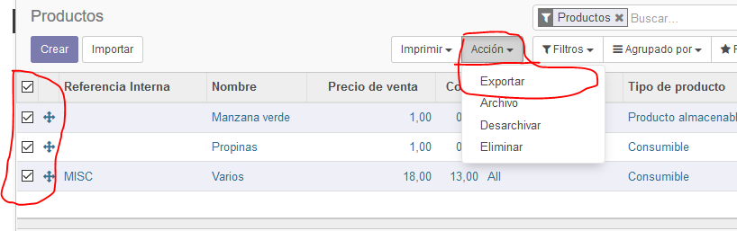
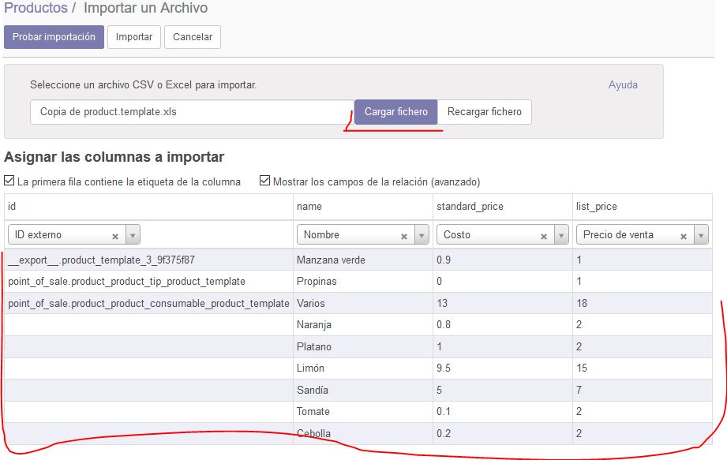

# CRM en ODOO

## Laboratorio 04

Listado de tareas:
------------------
1. Instalacion y/o verificación del modulo inventarios.
2. Configuración de almacenes.
3. Tipos de operaciones.
4. Gestión de productos.
5. Importación y exportación masiva de productos.
6. Ajustes de inventarios.
7. Transferencias internas.
8. Informes.

### Instalacion y/o verificación del modulo inventarios.

Buscamos e instalamos el módulo CRM en la ventana de aplicaciones, esperamos a que finalze el proceso y después ingresamos al nuevo módulo.

Dentro del módulo deberia verse de esta manera.

### Configuración de almacenes.

En los submenus podemos ver uno que dice configuración y dentro de este modificaremos para que acepte tener multialmacén, despues de habilitar la opción guardaremos los cambios.

Ahora ya podemos crear almacenes secundarios, asi que haremos uno dando clic en la opcion "crear"

Ahora editamos la informacion que trae por defecto y lo personalizamos un poco.

Agregaremos una nueva dirección del almacén y editaremos la informacion del mismo.

Tambien veremos algunas rutas que se han creado automaticamente para el almacén.

### Tipos de operaciones.

En el submenú de gestión de almacenes encontraremos la opción "Tipos de Operaciones", con estas podemos restringir a un usuario a que solo ralice ciertas cosas y no pueda hacer algunas otras

Tambien podemos encontrar en las configuraciones una opción para las rutas multietapa, esto nos permite realizar una operación que deba pasar por varias ubicaciones antes de que sea considerada completa.

### Gestión de productos.

Veremos el submenu de "Productos" y pasaremos a crear un nuevo producto.

Cuando creamos un producto viene seleccionada por defecto la opcion de "producto almacenable", por tanto está habilitado el control de stock y así le inficamos a Odoo que es un producto cuyas transferencias deben tener seguimiento.

Cuando modificamos a tipo servicio, desaparecen las opciones relacionadas al stock.

Y si seleccionamos consumible, habilitaremos el control de movimientos del producto, mas no el de stock.

En la pestaña inventario, veremos algunos detalles del producto, como el peso, volumen, etc.

Pasaremos a crear el producto manzana verde con estos datos:

Actualizaremos el stock del producto haciend clic en el botón "actualizar cantidad disponible" y modificaremos el valor por defecto a 10

Después de la modificación y guardar los datos haremos clic en la opción que dice "a mano" y nos mostrará el stock total de todos tus almacenes.

Otra cosa mas que nos da odoo es la opcion de imprimir etiquetas, para pegar en los anaqueles de venta.

Con la opción de movimientos de producto, nos permite rastrear los traslados del producto con almacenes o salidas de este.

### Importación y exportación masiva de productos.

En la vista de productos, haremos clic en el botón "lista", ubicado a la derecha debajo del filtro de buquedas.

Seleccionamos todos los productos y después haremos clic en la opción de "acción" y seguidamente en "exportar"

Nos mostrará un asistente para poder descargar un formato conocido como excel y la tarea de revisar los datos sea mas sencilla.
Esta opción no solo se da en la vista de productos, por lo que podemos extraer datos de todo tipo.

Ahora abrimos el excel que se ha generado después de exportado, veremos los datos de manera ordenada.

Añadiremos nuevos produtos como naranja, platano, etc.

Ahora guardamos los cambios de nuestro archivo y procedemos a importarlo desde Odoo

Con esto podemos ver los nuevos cambios subidos al sistema. toos los productos han sido importados correctamente y asi podemos agregar muchos mas productos eh importarlos de manera mas sencilla.

Nuestros productos estan registrados pero no tienen un stock, para ello pasaremos a crear un inventario de la siguiente manera.

### Ajustes de inventarios.

Editaremos la informacion que aparecerá por defecto, por ejemplo el nombre sera modificado a "Inventario inicial".

Si vemos la parte de "detalle del inventario" podemos verificar que los datos se han jalado de todos los productos que tenemos actualmente, entonces tambien pasaremos a modificarlo, ya que por defecto todo estara en cero (excepto manzana que ya tenia definido un stock).

Despúes de hacer las modificaciones validaremos los cambios haciendo clic en "validar inventario"

Como ya tenemos la información validada, entonces podemos ver reflejado el ajuste del stock de todos los productos.

### Transferencias internas.

Hacemos clic en "transfrencias" dentro del panel de "Operaciones" al lado izquierdo de la página y luego haremos clic en "crear"

Agregamos algunos productos a la transferencia creada anteriormente.

Nos generará un error debido a que no se ha seleccionado ningun tipo de operación hasta ahora, para ello haremos clic en "Info adicional" y despues en "Tipo de operación"

Entonces daremos clic en validar para hacer la transferencia.

Si entramos a un producto que haya sido trasladado, vemos que el stock no ha cambiado.

Si hacemos clic en "stock a mano" podemos ver que el stock se ha dividido en dos ubicaciones diferentes.

### Informes.

En el submenú de informes podemos encontrar la opción de valoración, que nos permitirá saber cuanto vale nuestro almacén actualmente o de acuerdo a la fecha que se seleccione.

Otra opción que encontramos es "Inventario", que me permite saber de manera rápida cuanto stock tengo de cada producto y en que almacén tengo cuanta cantidad.

Por último tenemos la opción "Movimientos de productos" el cual nos muestra cuantos y que movimientos se hicieron de todos los productos en el sistema.

