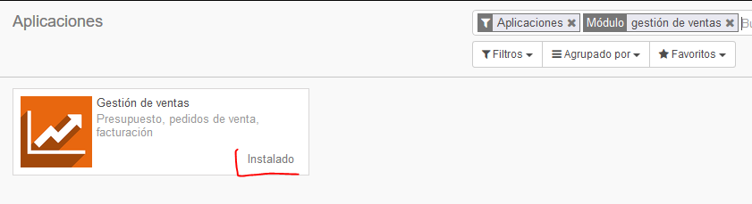
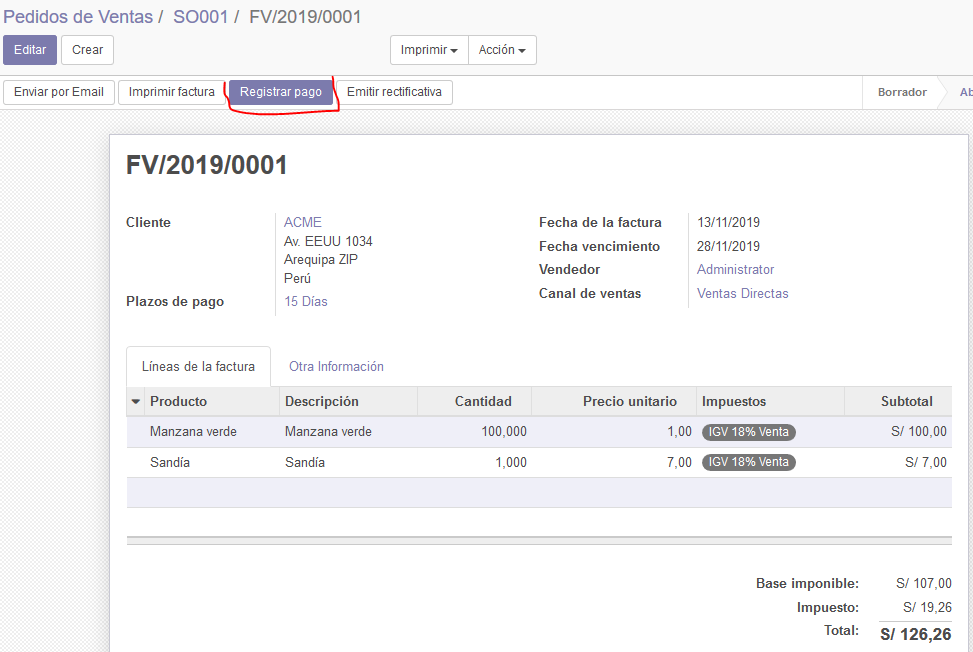
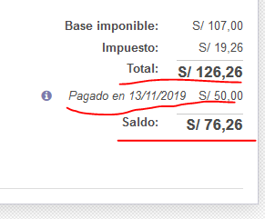
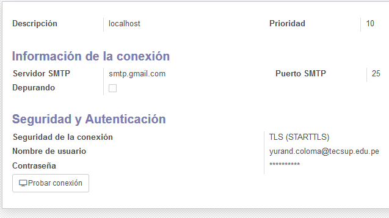

# CRM en ODOO

## Laboratorio 05

Listado de tareas:
------------------
1. Instalacion y/o verificación del modulo ventas.
2. Creción de cotización a cliente.
3. Entrga de productos de una Cotización.
4. Facturación y registro de pago de una cotización.
5. Configuración de envío de correos.
6. Cambio de Secuencia.
7. Lista de precios.
8. Portal del cliente.

### Instalacion y/o verificación del modulo ventas.

Pasaremos a instalar o a verificar la instalación del módulo "Gestión de ventas"

Veremos el módulo por dentro, después de su instalación se habilitara un nuevo menu de acceso hacia el.

Con esto podemos verificar que efectivamente el módulo se creo satisfactoriamete.

### Creción de cotización a cliente.

Entramos al menú "Cotizacion" para empezar a crear una nueva cotización.

Seleccionaremos manzanas verdes e ingresaremos 100 unidades.

Aún si falta stock creamos la cotización con dos productos por ahora

En la cotización podemos modificar los datos del cliente como la fecha, el plazo de pago, etc.

Ahora podemos modificar otra información adicional y modificar cosas como el almacén al cual se diigirá el pedido.

Despues guardamos y luego validamos. Al validar esta cotización se mostrarán nuevas opciones como el envio por correo, imprimir, confirmar, etc.

En caso el cliente no tenga correo electrónico, al momento de enviarle la cotización nos pedirá ingresar uno de todas formas, asi que ingresaremos un correo.

Despúes de ingresar el correo se nos mostrará un borrador del correo auto-generado por Odoo

Ahora la cotización que hemos creado pasará a ser un presupuesto

También podemos ver la nueva opción de Entrega y crear factura

### Entrga de productos de una Cotización.

Al entrar al módulo de inventarios, en el tablero principal podemos ver que ahora se ha generado una orden de entrega.

Al entrar a la entrega podemos validar nuestra venta, para ello debemos incrementar nuestro stock y lo haremos a 500 unidades

### Facturación y registro de pago de una cotización.

Crearemos una factura, para registrar un comprobante a enviar al cliente. Se nos abrirá una ventana que nos pregunta cómo queremos facturar, usaremos la opción "Líneas a facturar", lueg daremos clic en "Crear y Ver Facturas".
Con esto tendremos una factura lista para emitir, pero en caso algun dato este mal aún tenemos la opción a editarlo en esta ventana.
Despúes de dar clic en "Validar" aparecerán mas opciones en la factura. Y nos permitirá crear un correo adjuntando la factura.

Despúes de emitir la factura veremos como el estado del cliente cambia, mostrandonos un inidicador de ventas.

Volviendo a la factura, haremos clic en "registrar pago"

Por defecto veremos como se autocompleta la cantidad por la total de la factura y así poder cancelarla.

En este caso no se realizará el pago completo, así que haremos un pago parcial editamos la cantidad puesta por defecto y ponemos lo que realmente se va a pagar, el sistema detectará el cambio y nos mostrara dos opciones, marcaremos "Mantener abierto"

Al ver el detalle de la factura, en la parte de los totales veremos registrado el pago y saldo pendiente.

También podemos ver en el modulo de Facturación, al ver el comprobante en estado abierto y cuandto es el saldo.

### Configuración de envío de correos.

Por ahora enviamos dos correos pero ninguno fue enviado, esto se debe a que Odoo usa un servidor smtp de correo y debmos configurarlo.
Para ello activaremos el modo desarrollador y luego en ajustes buscaremos "Email", podemos ver que solo existe un servidor de correos, así que lo seleccionaremos.

Editaremos el servidor de correo. Ingresaremos la siguiente información correspondiente a cada uno.

También debemos configurar en nuestros correos el uso de "aplicaciones poco seguras" como lo llama gmail, para que nos permita hacer los envios.

Ahora de vuelta en Odoo probaremos la conexión.

Probaremos enviar otra factura a algún cliente. Para ello usaremos un correo personal distinto al usado anteriormente.

### Cambio de Secuencia.

Nuestra cotización se creó como la SO001. Esta es una secuencia interna de Odoo que se puede modificar si estamos en modo desarrollador, para lo cual iremos a ajustes, técnico, secuencias e identificadores, y finalmente, secuencias

En el buscador escribiremos "sale" para encontrar nuestra secuencia y después hacemos clic en ella.

Editamos la informacion como se muestra a continuación y guardamos los cambios.

### Lista de precios.

Veremos la lista de precios. Para esto, debemos ir al módulo Ventas, Ajustes y activamos la opcion "múltiples precios de venta por producto"

Ahora tendremos habilitado un Menú de Listas de precios. Crearemos una lista llamada Tarifa Mayorista.

Podemos ver que el detalle del producto, la pestaña de ventas cambia para poder elegir el precio de acuerdo a la lista.

Si editamos un cliente, ahora veremos que en la pestaña vetas y compras, ahora aparecerá la opción de lista de precios.

### Portal del cliente.

Vamos al detalle del cliente y damos clic en Acción, luego en Administración de acceso al portal

Le diremos al sistema que este cliente tiene acceso, dandole clic en el check al costado del correo

Esto nos envia un correo a nuestro portal electrónico.

Haremos clic en el enlace para poder establecer nuestra contraseña de cliente.

Ahora por fin tendremos acceso al portal del sistema

